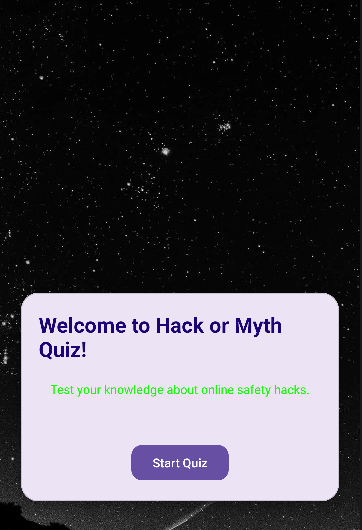
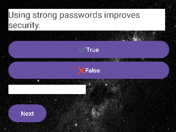
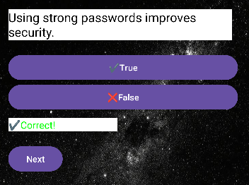
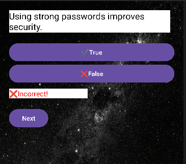
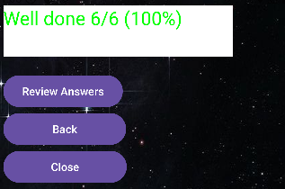
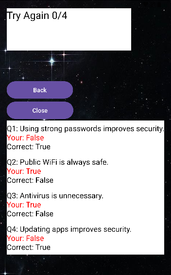

# 🔐Hack or Myth Quiz App
## 💻Overview
The Hack or Myth Quiz App is an Android application developed in Kotlin using Android Studio. 
This app tests users on cybersecurity knowledge using True or False questions.

## 🎯Purpose
This project shows:
- UI design principles.
- Activity navigation.
- Kotlin Programming Logic.
- User interaction handling.
- Data passing between screens.

## ✨Features

### 👨🏾‍💻Welcome Screen
- App introduction
- Start button to begin the Quiz
  

### ❓Quiz Screen
 

- FlashCard Style Questions
- Two Answer options:
  - True.
  - False.
    
- Feedback after answering:
  - ✅ Correct (Green).
    
  

  - ❌ Incorrect (Red).
 
   

 -Navigation through the questions.
 ### ⚽ Score Screen
 - Displays total Score.

   
  
 - Personalised feedback like:
 - "Well Done" (High Score)

  

-"Try again" (Low Score)

   

 
## 🎥Animations
- Smooth transitions between screens using slide animations.

## 🛠️ Technologies Used
- Kotlin (Application used)
- Android Studio (Development environment)
- XML Layouts (User Interface Layouts)
- Intents (Data Passing)

## ⚙️ How it Works
1. User starts the application from the welcome screen.
2. The quiz presents flashcard-style questions.
3. The user selects either “True” or “False”.
4. The app checks the answer using conditional logic (IF).
5. Immediate feedback is displayed (correct/incorrect).
6. The score is updated dynamically.
7. The final score is displayed with personalised feedback.
8. The user can review all answers on the score screen.

## 🧠 App Logic
- Questions and answers are stored using arrays.
- Each user selection is evaluated using conditional statements (IF/Else).
- The score is incremented when the correct answer is selected.
- The score and user responses are passed between activities using Intents.

## ⚠️ Challenges & Solutions

- Managing activity navigation between multiple screens was challenging.
  - Solution: Used Intents to pass data efficiently.
  
- Ensuring accurate score tracking across screens.
  - Solution: Implemented variables and passed them between activities.

- Designing a user-friendly interface.
  - Solution: Applied consistent layouts and visual feedback (color coding).

## 🚀 Installation
1. [Click here to view the repository](https://github.com/VNaidoo-DEV/VIRAATNAIDOOIMADASSIGNMENT2.git)
2. Open in Android Studio.
3. Sync Gradle.
4. Run on emulator or device.

## 🥤Conclusion
This project demonstrates a strong foundation in Android application development using Kotlin. 
It highlights key concepts such asuser interaction, activity navigation, conditional logic and data handling.
Through this project, practical experience was gained in building a functional, user- friendly mobile application that simulates real world quiz systems. 
The application can be further enhanced with database integration and advance UI components to meet industry standards.

## 🔮 Future Improvements
- Add Database (SQLite/Firebase).
- Add difficulty levels.
- Improve UI with Material Design Components.

## ✅Notes
- Arrays are used instead of mutable lists.
- No unnecessary functions are used.
- A loop is used to display results.
- The review feature is implemented within the score screen.
- A back button to retry the quiz.
- Close button to close the app. 

## 👨🏾‍💻 Author
Viraat Naidoo

## 📜 License
This project is for educational purposes.
