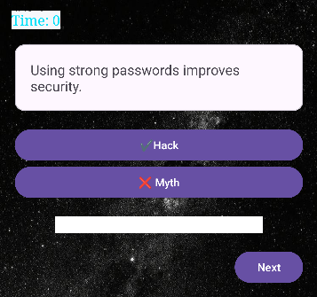
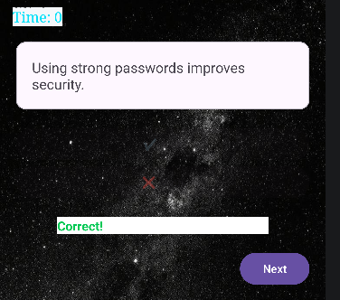
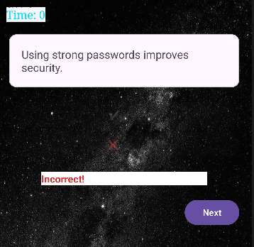

# 🔐Hack or Myth Quiz App
## 💻Overview
The Hack or Myth Quiz App is an Android application developed in Kotlin using Android Studio. 
It educates Users about cybersecurity awareness by allowing them to distinguish between real online safety practices ("Hacks") and common misconceptions ("Myths").

## 🎯Purpose
This project shows:
- UI design principles.
- Activity navigation.
- Kotlin Programming Logic.
- User interaction handling.
- Data passing between screens.

## ✨Features

### 👨🏾‍💻Welcome Screen
- App introduction
- Start button to begin the Quiz
  

### ❓Quiz Screen
 

- FlashCard Style Questions
- Two Answer options:
  - Hack (True)
  - Myth (False)
-Instant Feedback:
  - ✅ Correct (Green)
    
  

  - ❌ Incorrect (red)
 
     
  

