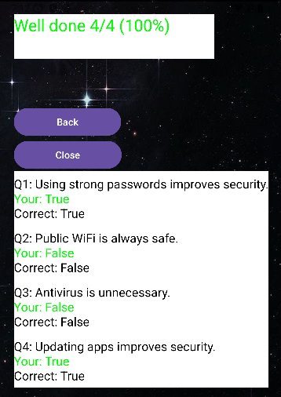

# 🔐Hack or Myth Quiz App
## 💻Overview
The Hack or Myth Quiz App is an Android application developed in Kotlin using Android Studio. 
This app tests users on cybersecurity knowledge using True or False questions.

## 🎯Purpose
This project shows:
- UI design principles.
- Activity navigation.
- Kotlin Programming Logic.
- User interaction handling.
- Data passing between screens.

## ✨Features

### 👨🏾‍💻Welcome Screen
- App introduction
- Start button to begin the Quiz
  

### ❓Quiz Screen
 

- FlashCard Style Questions
- Two Answer options:
  - True.
  - False.
    
- Feedback after answering:
  - ✅ Correct (Green).
    
  

  - ❌ Incorrect (red).
 
   

 -Navigation through the questions.
 ### ⚽ Score Screen
 - Displays total Score
 - Personalised feedback like:
 - "Well Done" (High Score)

   

-"Try again" (Low Score)

   

 

## 🎥Animations
- Smooth transitions between screens using slide animations.

## 🛠️ Technologies Used
- Kotlin
- Android Studio
- XML Layouts
- Intens (Data Passing)

## ⚙️How it Works
1. User Starts the App.
2. Navigates through the Quiz Questions.
3. Receives instant feedback.
4. Score is calculated.
5. Results displayed.
6. User reviews the answers that he/she got.

## 🚀 Installation
1. [Click here to view the repository](https://github.com/VNaidoo-DEV/VIRAATNAIDOOIMADASSIGNMENT2.git)
2. Open in Android Studio.
3. Sync Gradle.
4. Run on emulator or device.

## 🥤Conclusion
This project demonstrates the fundamental basics of understanding cybersecurity like:
- Basic Android UI design.
- Kotlin programming.
- Arrays and Loops.
- Activity navigation.

## 🔮 Future Improvements
- Add Database (SQLite/Firebase).
- Add difficulty levels.
- Improve UI with Material Design Components.

## ✅Notes
- Arrays are used instead of mutable lists.
- No unnecessary functions are used.
- A loop is used to display results.
- The review feature is implemented within the score screen.
- A back button to retry the quiz.
- Close button to close the app. 

## 👨🏾‍💻 Author
Viraat Naidoo

## 📜 License
This project is for educational purposes.
