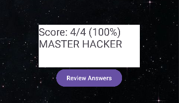
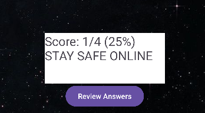
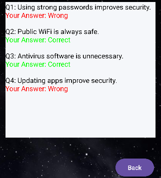

# 🔐Hack or Myth Quiz App
## 💻Overview
The Hack or Myth Quiz App is an Android application developed in Kotlin using Android Studio. 
It educates Users about cybersecurity awareness by allowing them to distinguish between real online safety practices ("Hacks") and common misconceptions ("Myths").

## 🎯Purpose
This project shows:
- UI design principles.
- Activity navigation.
- Kotlin Programming Logic.
- User interaction handling.
- Data passing between screens.

## ✨Features

### 👨🏾‍💻Welcome Screen
- App introduction
- Start button to begin the Quiz
  

### ❓Quiz Screen
 

- FlashCard Style Questions
- Two Answer options:
  - Hack (True).
  - Myth (False).
-Instant Feedback:
  - ✅ Correct (Green).
    
  

  - ❌ Incorrect (red).
 
   

 -Navigation through the questions.
 ### ⚽ Score Screen
 - Displays total Score
 - Personalised feedback like:
 - "Master Hacker!" (High Score)

   

-"Stay Safe Online" (Low Score)

   

### 📔Review Screen
- Displays all questions.
- Shows:
- Correct vs Incorrect answers.
- Color coded results.

  

## 🎥Animations
- Smooth transitions between screens using slide animations.

## 🛠️ Technologies Used
- Kotlin
- Android Studio
- XML Layouts
- Intens (Data Passing)

## ⚙️How it Works
1. User Starts the App.
2. Navigates through the Quiz Questions.
3. Receives instant feedback.
4. Score is calculated.
5. Results displayed.
6. User reviews the answers that he/she got.

## 🚀 Installation
1. [Click here to view the repository](https://github.com/VNaidoo-DEV/VIRAATNAIDOOIMADASSIGNMENT2.git)
2. Open in Android Studio.
3. Sync Gradle.
4. Run on emulator or device.

## 🔮 Future Improvements
- Add Database (SQLite/Firebase).
- Add difficulty levels.
- Improve UI with Material Design Components.

## 👨🏾‍💻 Author
Viraat Naidoo

## 📜 License
This project is for educational purposes.
